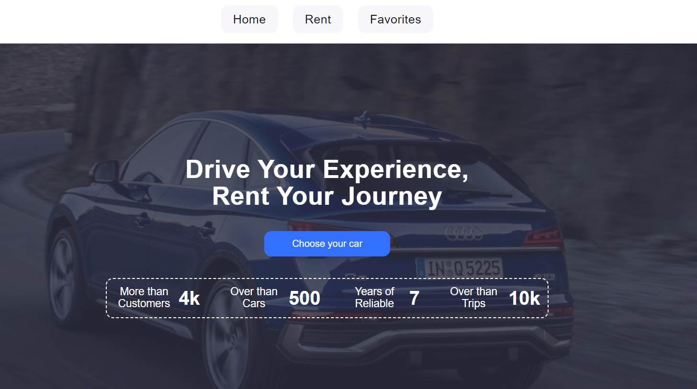

# CarRent project

### Drive Your Experience, Rent Your Journey

Welcome to my [site](https://vovalyapota.github.io/CarRent-project/) where you
rent some car.

<a href="https://vovalyapota.github.io/CarRent-project/" target="_blank"></a>

## 📃Technologies

- <a href="https://reactjs.org/" target="_blank">![React][React.js]</a>
- <a href="https://emotion.sh/" target="_blank">![Emotion][Emotion.js]</a>
- <a href="https://axios-http.com/ru/" target="_blank">![Axios][Axios.js]</a>
- <a href="https://formik.org/" target="_blank">![Formik][Formik.js]</a>
- <a href="https://numbrojs.com/" target="_blank">![Numbro][Numbro.js]</a>
- <a href="https://redux.js.org/" target="_blank">![ReduxToolkit][ReduxToolkit.js]</a>

## 🥁Getting Started

This is an example of how you may give instructions on setting up your project
locally. To get a local copy up and running follow these simple example steps.

1. Use the LTS version of Node.js.
2. Install the project's basic dependencies with the npm install command.

```sh
 npm install
```

3. Start development mode by running the npm run dev command.

```sh
 npm start
```

4. Go to the address indicated in the terminal in the browser.

```sh
Compiled successfully!

You can now view carrent-project in the browser.

  Local:            http://localhost:3000/CarRent-project
  On Your Network:  http://192.168.0.171:3000/CarRent-project

Note that the development build is not optimized.
To create a production build, use npm run build.
```

<!-- LINKS  -->

[React.js]:
  https://img.shields.io/badge/React-20232A?style=for-the-badge&logo=react&logoColor=61DAFB
[Emotion.js]: https://img.shields.io/badge/Emotion-D26AC2?style=for-the-badge
[Axios.js]:
  https://img.shields.io/badge/Axios-FFF?style=for-the-badge&logo=axios&logoColor=5A29E4
[Formik.js]: https://img.shields.io/badge/Formik-172B4D?style=for-the-badge
[Numbro.js]: https://img.shields.io/badge/Numbro-70a6c2?style=for-the-badge
[ReduxToolkit.js]:
  https://img.shields.io/badge/ReduxToolkit-764abc?style=for-the-badge
